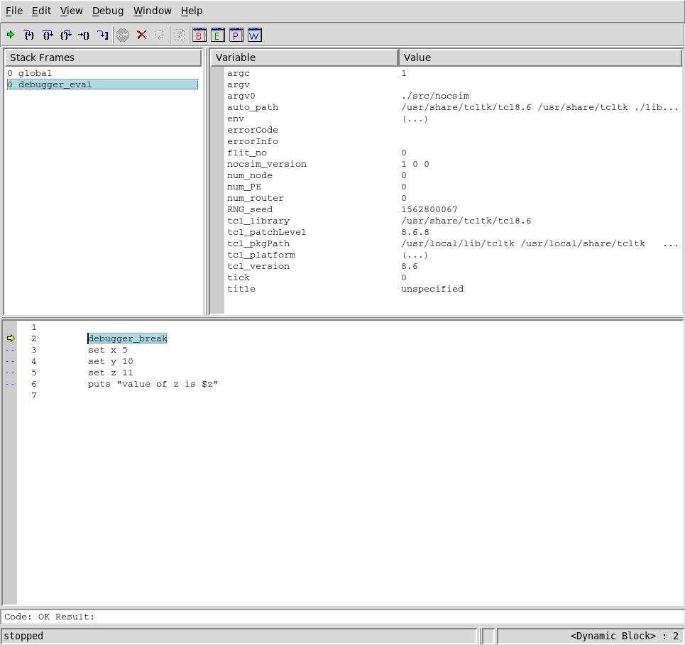

# `nocsim` TCL Scripting Manual

`nocsim` implements a simple DSL (domain-specific language) for performing NoC
simulations, based around TCL. Your system's standard TCL interpreter is used
as a base, and special *magic variables* linked to aspects of the internal
simulation state are exposed for use from TCL script files. Several functions
are exposed also via TCL to make it easy to manage the simulation state, and
collect statistical information about the simulation's results.

## Programming Model

A single invocation of `nocsim`, the corresponding script file, and the
parameters given to it constitute a single *simulation run*. Each simulation run
is independent from each other simulation run, and is fully synchronous,
single-threaded, and independent from every other simulation run. This approach
was selected because in most uses for `nocsim`, dozens or hundreds of different
parameters need to be evaluated for performance, so it is simpler for each
simulation to be single threaded and simply run many simulations in parallel
with a tool such as GNU parallel.

A useful strategy can be to generate one line of tab-separated values from each
simulation run such that all lines from all simulation runs may be concatenated
together at a later time, and thereby produce a valid TSV file that can be used
in conjunction with any standard statistics or plotting tools.

When `nocsim` is compiled without debugging enabled, the only output on
standard out originates from the TCL script file, and several convenient hooks
are provided for the programmer to create callbacks that enable performance
counters to be implemented. Some performance counters are implemented in the
underlying simulation engine and exposed as magic variables.

It is suggested that the programmer should implement any statistical analysis
directly in TCL, by calling utility programs from TCL, or by using the TCL
script file to generate output that is convenient to parse via an external
tool.

Implementation details such as these are beyond the scope of this document,
however the programmer should be advised that TCL includes a robust statistics
library [(documented
here)](https://tools.ietf.org/doc/tcllib/html/statistics.html) in the form of
`math::statistics` which may be of value both for data generation, and for
analysis.

## TCL Environment

`nocsim` requires at least TCL version 8.5, so any script files may assume at
least this version. `nocsim` will correctly populate `$argv0`, `$argc`, and
`$argv` for the script file's use, and further `$tcl_library` is extracted from
the system copy of `tclsh` (or the first occurrence of such in `$PATH`). The
system `init.tcl` file is sourced from the detect `$tcl_library`.

This means that any TCL libraries installed at a system level should be
available for use from within `nocsim` script files.

## Debugging Methodology

TCL has had a variety of debuggers and debugging approaches over it's long
life. Any debugging approach that works within an embedded TCL instance should
work correctly with `nocsim`. However, for your convenience, an approach to TCL
script debugging is discussed and documented here.

TclPro was once a popular distribution of TCL and associated tools which
retailed for a hefty price tag. It was eventually open sourced, but waned in
popularity and languished in obscurity for some time. Eventually, the TclPro
debugger was forked by [FlightAware,
LLC](https://github.com/flightaware/TclProDebug) and updated for TCL 8.5 and
higher. This updated version of TclProDebug is recommended for use with
`nocsim`, and compatibility is specifically tested as it is used as part of the
`nocsim` development process.

For the purposes of this document, it is assumed that TclProDebug is installed
in `/opt/TclProDebug`. You may need to adjust some steps according to it's
actual install location on your system.

First, you should start a debugging session by running
`/opt/TclProDebug/bin/prodebug`, selecting *File->New Project*. Make sure to
select "Remote Debugging" in the dialog window, then click "Apply".

Next up, you will want to wrap your TCL code you would like to debug in a
`debugger_eval` block. Consider this example file:

```tcl
source /opt/TclProDebug/lib/tcldebugger/initdebug.tcl
debugger_init
debugger_eval {
	debugger_break
	set x 5
	set y 10
	set z 11
	puts "value of z is $z"
}
debugger_break
```

If you save this file and `source` it from within a `nocsim` interpreter, it
should automatically connect to your running instance of TclProDebug, and you
should see the code appear in your TclProDebug window. It should look something
like this:



You can now inspect variables via the interactive inspection tool, and single
step your code or allow it to run until it hits a breakpoint.

**TIP** you can leave your debugging code in even after development has
completed -- if TclProDebug is not running on your system, `debugger_break`
does nothing, and `debugger_eval` acts like `eval`.

For more information, you may wish to consult [the TclPro User's
Guide](https://www.tcl.tk/software/tclpro/doc/TclProUsersGuide12.pdf).

## Magic Variables

Note that additional magic variables are available during callback execution
and are documented in the *Callbacks* section later in this document. The magic
variables described here should be treated as read-only while the simulation is
running, including during callback execution -- modifying the value of these
variables during such times will result in undefined behavior.

**NOTE** for technical reasons, the read-only or read+write status may or may
not actually be enforced by the TCL interpreter. Even if they are not, you
should respect them or risk causing undefined behavior.

| variable name | r/w | description |
|-|-|-|
| `RNG_seed` | r | value used to seed the random number generator |
| `num_PE` | r | number of instantiated PEs |
| `num_router` | r | number of instantiated routers |
| `num_node` | r | number of instantiated nodes |
| `flit_no` | r | number of injected flits so far + 1 |
| `tick` | r | current tick number, starting at 0 |
| `title` | r+w | simulation title, defaults to "unspecified" |
| `nocsim_version` | r | list containing `nocsim` major, minor, and patch numbers in that order |

## Simulation Procedures

### `router ID ROW COL BEHAVIOR`

Creates a new router instance with the given row and column values. `ID` may be
any non-empty identifier string, but should be unique (a stringified version of
`$num_node + 1` may be a good option). `BEHAVIOR` should be the name of a
behavior callback which will be called once per tick to define how this node
behaves.

### `PE ID ROW COL BEHAVIOR`

Exactly as with `router`, except that the instantiated node will be a PE. Note
that the behavior callbacks for PEs and routers may not be interchangeable,
depending on how they are implemented.

### `link FROM_ID TO_ID`

Creates a new link, connecting the specified node IDs.

### `current`

Returns the node ID for which the behavior callback is currently executing.

### `step` / `step N`

Advances the simulation by `N` ticks, or by 1 tick if `N` is not provided.

### `nodeinfo ID ATTR`

Retrieve Information about the node `ID`. The following attributes are
available:

| `ATTR` | Type | Description |
|-|-|-|
| `type` | int | either `type_router` or `type_PE` indicating the node type |
| `row` | int | row number of the node |
| `col` | int | column number of the node |
| `behavior` | string | behavior callback for this node |
| `injected` | int | number of flits injected thus far |
| `routed` | int | number of flits routed thus far |

### `linkinfo FROM TO ATTR`

Retrieve information about the link connecting the nodes with ID `FROM` and
`TO`.

`ATTR` specifies the information to retrieve.

| `ATTR` | Type | Description |
|-|-|-|
| `in_flight` | list of int | list of flit numbers currently in the link |
| `current_load` | int | number of flits currently in the link |
| `load` | int  | number of flits routed through this link so far |

**NOTE** `current_load` should be used with care, as it may yield inaccurate
results if accessed during a behavior callback.

**TIP** remember that links are strictly directional, i.e. the link `foo bar`
is not the same as the link `bar baz`.

### `findnode` / `findnode ROW COL` / `findnode ROWL ROWU COLL COLU`

Depending on the number of parameters provided:

* return a list of all node IDs
* return a list of node IDs that have the row and column `ROW`, `COL`,
* return a list of node IDs which have a row number bounded by `ROWL` and
  `ROWU` (inclusive) and a column number bounded by `COLL` and `COLU`
  (inclusive).

### `behavior ID BEHAVIOR`

Modify the assigned behavior for the node with the specified ID.

### `randnode` / `randnode ROW COL` / `randnode ID`

Depending on the number of parameters provided:

* return a random node ID
* return a random node ID which does not have the row and column values `ROW`,
  `COL`
* return a random node ID which is not `ID`.

In each case, `randnode` will only ever return nodes of type PE.

### `registerinstrument INSTRUMENT PROCEDURE`

Register the TCL procedure `PROCEDURE` to be called by the specified
instrument. Each instrument may only have one registered procedure at a time.
See the *Instrumentation* section below for more information.

### `conswrite STR`

Write a specified string either to standard output, or to the GUI console,
depending on how `nocsim` is being executed.

### `errwrite STR`

Write a specified string either to standard error, or to the GUI console
depending on how `nocsim` is being executed. Text displayed in the GUI console
will be colored red.

Aside from targeting either stderr or coloring the text red, this command
behaves identically to conswrite.

### `route FROM TO` (routing behaviors only)

Routes the flit incoming from the direction `FROM` to the direction `TO`. `TO`
and `FROM` should both be integers corresponding to directions, the magic
variables `dir_*` are provided to make this process easier.

### `drop FROM` (routing behaviors only)

Drops the  flit incoming from the direction `FROM`. This will immediately
delete the flit from the simulation. This will trigger neither the `arrive` nor
the `route` instruments with respect to the specified flit. Performance
counters for the relevant router and it's links are not updated.

### `peek DIR ATTR` (routing behaviors only)

Retrieves the attribute `ATTR` from the incoming flit in the direction `DIR`.

The following attributes are available:

| `ATTR` | Type | Description |
|-|-|-|
| `from` | string | `id` of originating node |
| `to` | string | `id` of destination node |
| `from_row` | int | row of originating node |
| `from_col` | int | column of originating node |
| `to_row` | int | row of destination node |
| `to_col` | int | column of destination node |
| `spawned_at` | int | tick number at which the flit instantiated |
| `injected_at` | int | tick number at which the flit was injected |

### `avail DIR` (routing behaviors only)

Considers the outgoing link `DIR` for the current node (where `DIR` is one of
the `dir_*` magic variables). Returns one of the following values:

| return value | meaning |
|-|-|
| 0 | link available for use |
| 1 | link already used this tick |
| 2 | no such link |

### `incoming DIR` (routing behaviors only)

`DIR` should be specified as an integer in `nocsim`'s internal format.

Returns 1 if there is a flit incoming from the specified direction,
and 0 otherwise. Note that routing a flit removes it from the relevant incoming
link;

### `allincoming` (routing behaviors only)

Returns a list of all directions (in `nocsim`'s internal integer format) from
which there is an incoming flit awaiting processing. Using `route` to route the
flit elsewhere will cause it to stop appearing in this list.

### `inject TO` (PE behaviors only)

Inject a new flit destined for the node ID `TO`, The originating node is always
the current node, which may be tested via the `current` procedure.

## Utility Procedures

### `PrintNocsimInfo`

Display the `nocsim` and TCL versions.

### `dir2int DIR`

Converts a string direction (`DIR`) to an internal integer representation used
by `nocsim`. Valid direction strings include:

* `n`
* `north`
* `up`
* `s`
* `south`
* `down`
* `e`
* `east`
* `right`
* `w`
* `west`
* `left`
* `p`
* `pe`

**NOTE** direction strings are case insensitive.

**BEST PRACTICE** it is suggested to always use the abbreviated style
(`n`/`s`/`e`/`w`/`pe`). Other styles are made available for user friendliness in
interactive interpreters.

### `int2dir DIR`

Converts an integer direction (`DIR`) in `nocsim`'s internal representation to
to a string representation. The generated string representation will always be
in the abbreviated `n`/`s`/`e`/`w`/`pe` style.

### `type2int TYPE`

Converts a string node type to `nocsim`'s internal integer representation.
Valid node types are:

* `router`
* `pe`

**NOTE** node type strings are case insensitive

### `int2type TYPE`

Converts an integer type in `nocsim`'s internal representation to a string.

### `all_adjacent ID`

Returns a list of all node IDs which are adjacent (i.e. north, south, east, and
west) to the node with the specified ID. Note that links need not be present
for adjacent nodes to be detected, this makes this function suitable for use
during link generation.

### Topography Generators

### `create_mesh WIDTH HEIGHT INJECT_BEHAVIOR ROUTE_BEHAVIOR`

Creates an undirected mesh topography with `WIDTH` many columns and `HEIGHT`
many rows. All instantiated PEs will have the specified injection behavior, and
all instantiated routers will have the specified `ROUTE_BEHAVIOR`. Nodes will
have automatically generated IDs.

Returns a list of node IDs that were generated.

## Behavior Callbacks

The behavior of each node in simulate network is defined by a *behavior
callback* (sometimes shortened to simply *behavior*). This is a TCL function
which implements the abhor that is desired for the particular node.

There are two types of behaviors -- PE behaviors and router behaviors. While in
principle, it would be possible to write a single behavior that detects the
type of node it is operating on and acts accordingly, it is suggested to define
separate behaviors for each. Attempting to inject flits from a routing
behavior, or perform routing operations from a PE behavior will result in
undefined behavior.

A behavior is implemented as a TCL procedure, which may be defined either in
your simulation script, or included from a separate TCL library. The procedure
should take no arguments; all necessary information about the simulation state
is provided via magic variables and procedures.

**NOTE** routing callbacks are **required** to handle all incoming flits each
time they are called. Flits must either be routed, or dropped using the `drop`
procedure. Failure to do so will cause the `nocsim` to exit with an error.

**TIP** the magic variables provided by nocsim are defined in the top-level
namespace of the interpreter instance. This means they are not directly
accessibly from within procedure calls, including behavior callbacks. It is
suggested that they might be accessed using the
[`upvar`](https://wiki.tcl-lang.org/page/upvar) command. For example, to alias
`tick` from the top-level namespace into a behavior callback, issue `upvar 1
tick tick`.

**WARNING** although behavior callbacks are executed in serial, care is taken
with respect to the design of the simulation engine to ensure that the
simulation results are as if every behavior for every node on a given tick
happened "at once". It is ostensibly possible to construct behavior callbacks
which have dependencies on execution order or intermediary simulation state
(such as via `linkinfo`). Such designs are explicitly not supported, and the
execution order of behavior callbacks is an internal implementation detail of
`nocsim` and should not be relied upon.

**TIP** it is very important to ensure that all incoming flits are handled when
defining a routing behavior, otherwise those flits may be lost while the engine
flips the next state into the current state at the end of the tick.  If you are
concerned that you might be missing some incoming flits, try using the `inject`
and `arrive` instruments to track which flits are still in-flight (have not
arrived yet).

### Example Behavior Callback

```tcl
proc simpletest {} {
	upvar 1 tick tick
	set current [current]
	puts "===== simpletest ===="
	puts "current is: $current"
	puts "type is: [nodeinfo $current type]"
	puts "row is: [nodeinfo $current row]"
	puts "col is: [nodeinfo $current col]"
	puts "tick is: $tick"
}
```

## Performance Counters

For convenience and performance, many useful statistics are collected and
exposed via performance counters. These are maintained internally by the
simulation engine. Consult the documentation for the `nodeinfo` and `linkinfo`
procedures, as well as for magic variables.

## Instrumentation

More detailed performance information can be obtained via instrumentation. An
*instrument* is a TCL procedure which is automatically called at a specific
point in the simulation engine's execution. Additional information is passed
into instruments via parameters.

**TIP** some instruments are called within the simulation engine's hot loop,
and can significantly degrade performance. Prefer the use of performance
counters wherever possible.

**TIP** need to store data collected by an instrument? Try using
`upvar` to attach it to the interpreter's top-level scope.

**WARNING** Keep in mind that most instruments are called while the TCL
interpreter is within the scope of a behavior, so you should always use `upvar
#0 ...` to attach to the global interpreter scope directly, rather than the
scope of the currently executing behavior. The specific arrangement of TCL
scopes within `nocsim` is an implementation detail -- you should always use
`upvar #0` rather than `upvar 1`, `upvar 2`, and so on unless you really know
what you're doing.

**BEST PRACTICE** don't make assumptions about the number of parameters that
will be passed to an instrument -- more information might be added in future
releases of `nocsim`.

Instruments are *registered* so that the simulation engine is aware of them via
the `registerinstrument` procedure.

The following instruments are available:

### `inject`

Executes any time a flit is injected.

Parameters:

* origin node ID
* destination node ID
* flit number

### `route`

Executes any time a flit is routed.

Parameters:

* origin node ID
* destination node ID
* flit number
* tick number on which the flit was spawned
* tick number on which the flit was injected
* number of hops so far
* node ID of node from which the flit was routed
* node ID of the node to which the flit was routed

### `arrive`

Executes any time a flit arrives at it's destination.

Parameters:

* origin node ID
* destination node ID
* flit number
* number of hops so far
* tick number on which the flit was spawned
* tick number on which the flit was injected

### `backroute`

Executes any time a flit is backrouted.

Parameters:

* origin node ID
* destination node ID
* flit number
* number of hops so far
* tick number on which the flit was spawned
* tick number on which the flit was injected

### `tick`

Executes at the beginning of each new tick. No special parameters are passed to
this instrument. This instrument is mostly useful for performing cleanup or
initialization between ticks.

## Terminology

* **origin node** -- in the context of a flit, the node at which was flit was
  spawned.
* **destination node**  -- in the context of a flit, the node to which a flit
  is being transmitted.
* **spawn** -- a flit is *spawned* when it's origin node creates it via the
  `inject` command.
* **inject** -- a flit is *injected* when it is transmitted from it's origin
  node (a PE) to a router without being back routing
* **backroute** -- `nocsim` simulates backpressure by counting any event where
  a flit is transmitted back to it's origin node (a PE) from an immediately
  adjacent router (i.e. if the router lacks the buffer or outgoing link
  capacity to handle the flit this tick). When backrouting occurs, the
  backrouted flit is installed at the head, rather than the tail of the
  outgoing flit queue from it's origin node (i.e. it continues to be "first in
  line"). Backrouting still counts as a "hop".
* **hop** -- any tick where a specific flit travels between two adjacent nodes.
* **instrument** -- a TCL procedure called in response to a specific event
  occurring within the simulation.
* **behavior** -- a TCL procedure used to define how a particular node in the
  network under simulation should act.

## Advanced Topics

### Reporting Strategies

Information is intended to be collected via the "instrumentation" feature of
`nocsim`. Instruments might either output information of interest via
`conswrite` for later analysis by an external program, or might use `upvar` to
save data into a global variable for later analysis after the simulation is
concluded (i.e. after the last call to `step` has returned).

As long as the magic variables and procedures that `nocsim` exposes are not
collided with, the programmer has complete free reign to use any TCL programmer
patterns or strategies that are desired, including defining procedures, import
libraries, setting variables, or performing file I/O operations.

### Simulation Parameterization

It is often the case that a given simulation might need to be run with several
different slight variations; for example, different injection rates or link la
tenses. To that end, `argv` and `argc` are passed in from the top-level
`nocsim` program, sans any flags or other options used to set the behavior of
nocsim itself. The suggested approach to simulation parametrization is to
simply provide any needed parameters as positional arguments to `nocsim`, and
then inspecting the `$argc` and `$argv` variables.

**TIP** The GUI version of `nocsim` does not pass in it's `argc` and `argv`,
however you may simply set these variables before `source`-ing the code you
intend to run.

### Data Formats

TCL supports a variety of common file formats which may be of use for
inter-operating `nocsim` simulations with other tools.

* XML
	* [tDOM](https://core.tcl-lang.org/tdom/timeline)
		* Appears to be the most active / up-to-date XML implementation
	* [Tcler's Wiki XML page](https://wiki.tcl-lang.org/page/XML)
	* [TclXML Library](http://tclxml.sourceforge.net/tclxml/3.2/README.html)
* JSON
	* The TCL standard library includes a [JSON module](https://core.tcl-lang.org/tcllib/doc/tcllib-1-18/embedded/www/tcllib/files/modules/json/json.html)
* YAML
	* The TCL standard library includes a [YAML module](https://core.tcl-lang.org/tcllib/doc/tcllib-1-18/embedded/www/tcllib/files/modules/yaml/yaml.html)
* INI
	* The TCL standard library includes an [INI module](https://core.tcl-lang.org/tcllib/doc/tcllib-1-18/embedded/www/tcllib/files/modules/inifile/ini.html)
* CSV
	* The TCL standard library includes a [CSV module](https://core.tcl-lang.org/tcllib/doc/tcllib-1-18/embedded/www/tcllib/files/modules/csv/csv.html)

## TCL Resources

* [Tcl Library Source Code](https://core.tcl-lang.org/tcllib/doc/trunk/embedded/md/toc.md)
* [Practical Programming in Tcl and Tk (4th Edition)](https://www.amazon.com/Practical-Programming-Tcl-Tk-4th/dp/0130385603)
* [The Tcler's Wiki](https://wiki.tcl-lang.org/page/Online+Tcl+and+Tk+Tutorials)
* [Tcl/Tk Documentation](https://www.tcl-lang.org/man/tcl/contents.htm)
